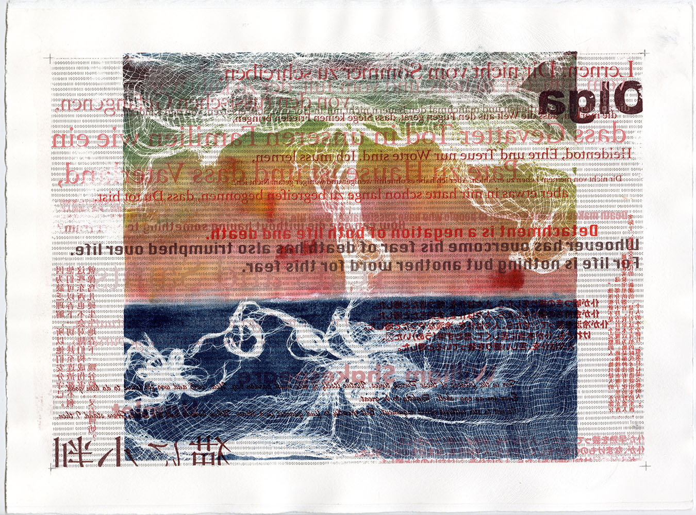

Welcome to my page! This is a webpage for my data science class [P8105](https://p8105.com/). You can also see introduction about me and my working experience.

## Meet Libby

This is Libby, my best friend's puppy. I got to know her for five years, and I'm her favorite person while I'm staying in my friend's house. She is the cutest little thing. She is always playful and her little body is very energetic.

## About me

I received a BS in Applied Math and Statistics from [University of Massachusetts, Amherst](https://www.umass.edu/) in 2020.

Right now, I'm a first year Master student major in [Biostatistics](http://www.mailman.columbia.edu/academic-departments/biostatistics) at [Columbia University](https://www.columbia.edu/).

* [About me](about.html)

## Interests

I love photographing, painting and printmaking. I was minoring [studio art](https://www.umass.edu/art/department-art) during bachelor degree. Studying arts help me to develop critical thinking and the ability to interpret the world around us.

_Struggle 5. 2020, Digital Mixed Media, Monoprint on paper._

If you wnat to see more photos and art works, please check out my photosite and Instagram.

* [Photosite](https://elainexu0421.wixsite.com/photosite)